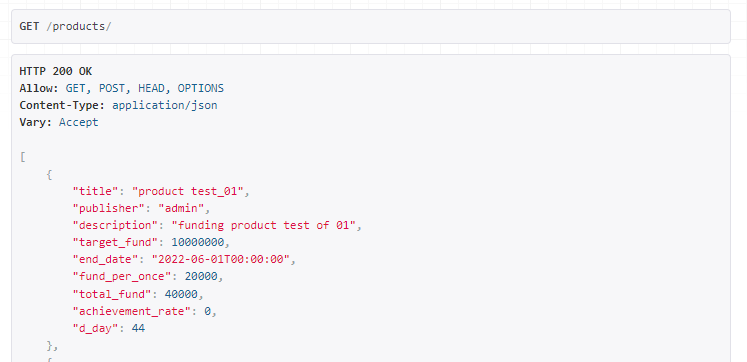
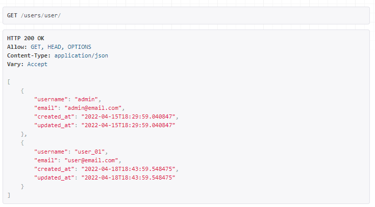

# wanted_pre_onboarding

원티드 프리온보딩 코스 _ Backend 과정 선발과제 ([링크](https://docs.google.com/document/d/1Wu429EZ9tR72ITb5u_5wCfw8s5_U_07a01rWEFZiKyQ/edit))

## Description
- 크라우드 펀딩 기능을 제공하는 서비스
	- 게시자는 크라우드 펀딩을 받기 위한 상품(=게시물)을 등록/수정/삭제/상세조회 할 수 있습니다.
	- 상품 목록에서 임의의 문자열이 포함된 상품 검색 기능, 특정 조건에 맞는 상품 정렬 기능으로 목록을 가져올 수 있습니다.

## Project Goal (Requirements)
- [ ] 상품 등록
	- `제목`, `게시자명`, `상품설명`, `목표금액`, `펀딩종료일`, `1회펀딩금액`으로 구성
- [ ] 상품 수정
	- 모든 내용이 수정 가능하나 `목표금액`은 수정불가
- [ ] 상품 삭제
	- DB에서 삭제
- [ ] 상품 목록
	- `제목`, `게시자명`, `총펀딩금액`, `달성률`, `D-day`가 포함
	- `달성률` : `총펀딩금액`/`목표금액`*100 (소수점 무시)
	- `D-day` : 펀딩 종료일까지
	- [ ] 상품 검색 : 검색된 문자열 포함된 상품 리스트 조회
	- [ ]  상품 정렬 : `생성일`, `총펀딩금액` 기준으로 정렬
- [ ] 상품 상세
	- `제목`, `게시자명`, `총펀딩금액`, `달성률`, `D-day`, `상품설명`, `목표금액`, `참여자 수`가 포함

## Implementation

### Tech Stack
   

### Development Period
* 2022.04.11 - 2022.04.18

> ### ERD


- 상품 펀딩에 대한 정보를 `Product`에서 분리해 `Funding`모델 생성
- 추후 유저 정보 조회시 유저 개개인의 펀딩 정보를 확인하기에도 유용할 것으로 판단

> ### API Specification
#### 상품 등록 (Product Create)


- POST /products/
- `제목(title)` 이름으로 새로운 상품 DB 저장
- 로그인 한 유저의 정보가 게시자 정보로 등록되므로 로그인 기능 구현 필요
  
#### 상품 수정 (Product Update)


- PUT /products/{int:product_id}/
- `총펀딩금액(total_fund)`을 제외하고 수정 가능

#### 상품 삭제 (Product Delete)


- DELITE /product/{int:product_id}/
- 상품 DB 삭제

#### 상품 목록 (Product List)


- GET /products/
- `제목(title)`, `게시자명(publisher)`, `총펀딩금액(total_fund)`, `달성률(achievement_rate)`, `D-day(d_day)`를 포함한 상품 목록 출력
- *.../?ordering = (-)created_at* or *(-)total_fund* 형태로 
- *.../?search = {str}* 형태로 임의의 문자열에 맞는 검색 가능

#### 상품 상세 (Product Detail)


- GET /products/{int:product_id}/
- `제목(title)`, `게시자명(publisher)`, `총펀딩금액(total_fund)`, `달성률(achievement_rate)`, `D-day(d_day)`, `상품설명(description)`, `목표금액(target_fund)`, `참여자 수(participants)`를 포함한 상품 상세 출력

#### 유저 조회 (User List/Detail)


- GET /users/user/
- 가입한 유저 목록 출력


- GET /users/user/{int:user_id}/
- 유저 상세 출력

### Step to run
```
$ python -m venv venv
$ source venv/Scripts/activate
$ python install -r requirements.txt
$ python manage.py runserver
```

## Notes for commit convention
- Add : 기초적 세팅이나 코드, 문서 추가
- Feat : 새로운 기능 추가
- Fix : 버그 수정
- Update : 코드나 문서 보완
- Test : 테스트 코드 추가
- Rename : 이름 변경
- Comment : 주석 추가, 변경

## Author
Backend : :monkey_face: **Kang Jeonghui**
